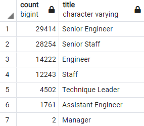

# Pewlett-Hackard Analysis

## Overview
The purpose of our analysis is to determine how many current Pewlett-Hackard employees are nearing retirement age and determine how this "silver tsunami" will affect the PH workforce. We will break down retirement numbers by department, as well as identify cohorts of younger employees who might be good candidates for mentorship to help ease the transition.

## Results

- There are 90,398 employees nearing retirement age at Pewlett-Hackard. 
- Many of those nearing retirement are in senior roles, the title breakdown is as follows:
 

- Only 1,549 current employees meet the current eligibilty criteria for the mentorship program of having a birthdate in 1965.
- If we change the criteria to having a birthdate in 1964, the number of eligible candidates incleases to 18,356. If we change it to having a birthdate in 1961 through 1964, the eligible candidate pool increasees to 73,770.

## Summary

As the "silver tsunami" begins to make an impact P-H will have to fill as many as 90,398 positions to replace current employees who are nearing retirement age. While there are more than enough qualified, retirement-ready employees to mentor the next generation of P-H employees, there are far fewer candidates that meet the current eligibility requirements for the mentorship program. Recommendations for additional queries include:

1. Expanding the criteria to include all employees born between 1961 and 1964 and seeing how that affects the number of employees eligible for the mentorship program
2. Grouping the eligible candidates by title and comparing that to the Retiring Titles table to assess how the numbers of mentors and mentees align.
3. Examining these same factors on the departmental level to determine whether there are any specific departments that will be hit harder.
